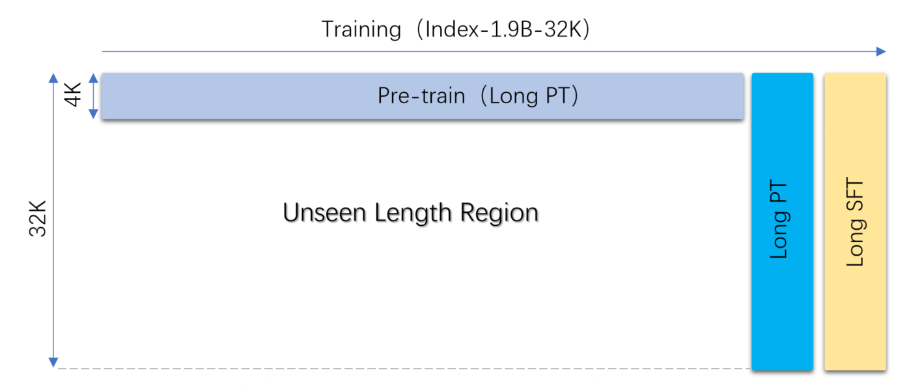
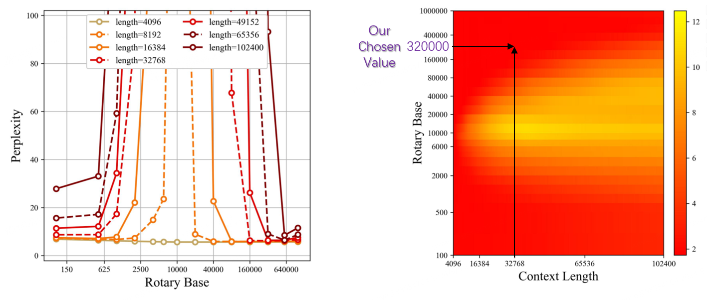
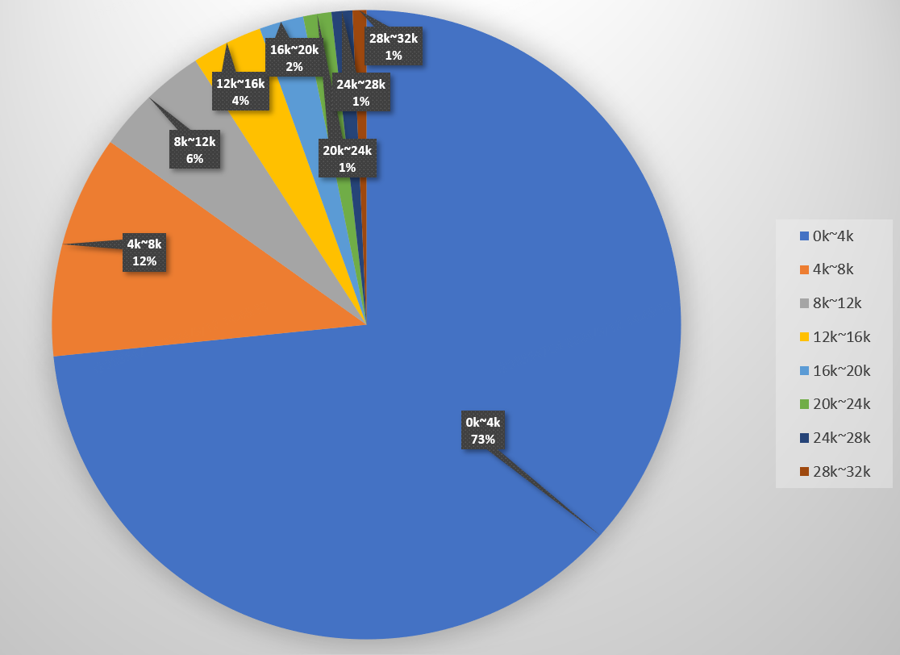
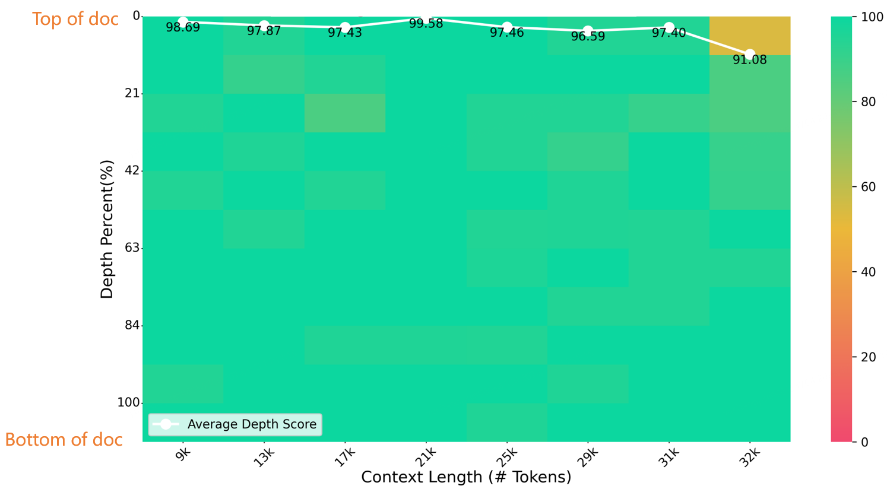
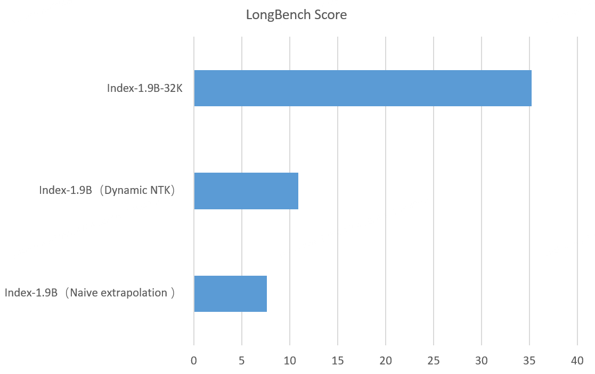
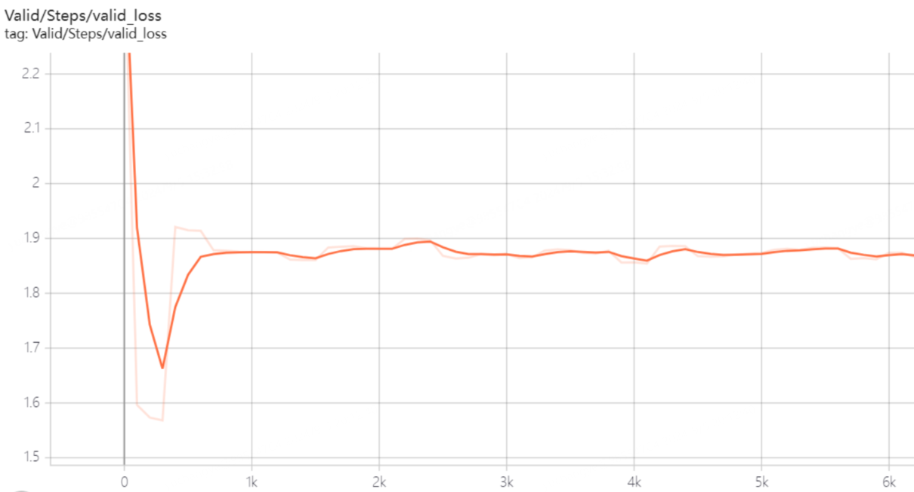

<div align="center">

  <h1>
    <font size="6">Index-1.9B-32K Long Context Technical Report</font>
  </h1>

---
[切换到中文](https://github.com/bilibili/Index-1.9B/blob/main/Index-1.9B-32K长上下文技术报告.md)
</div>

---
# Model and Introduction

## Index-1.9B-32K Introduction

Index-1.9B-32K is a language model with only 1.9 billion parameters, yet it supports a context length of 32K (meaning this extremely small model can read documents of over 35,000 words in one go). The model has undergone Continue Pre-Training and Supervised Fine-Tuning (SFT) specifically for texts longer than 32K tokens, based on carefully curated long-text training data and self-built long-text instruction sets. The model is now open-source on both Hugging Face and ModelScope.

Despite its small size (about 2% of models like GPT-4), Index-1.9B-32K demonstrates excellent long-text processing capabilities. 
As shown in the figure below, our 1.9B-sized model's score even surpasses that of the 7B-sized model. Below is a comparison with models like GPT-4 and Qwen2:

<p align="center">  
</p> <p align="center"><strong>Comparison of Index-1.9B-32K with GPT-4, Qwen2, and other models in Long Context capability</strong>
</p>

## Model and Code Download:
- Huggingface: <https://huggingface.co/IndexTeam/Index-1.9B-32K>
- Modelscope: <https://modelscope.cn/models/IndexTeam/Index-1.9B-32K>
- Github: https://github.com/bilibili/Index-1.9B  (This includes the technical report, running & evaluation code. The model and evaluation code are open-sourced, and **you can reproduce** our results, see: [Evaluation Instructions](evaluate/README.md))


# Training Process

Index-1.9B-32K was further trained based on the already open-source Index-1.9B, with two additional training stages:
1. **Long PT**: Long continue Pre-Training, continual pre-training on long data.
2. **Long SFT**: Supervised Fine-Tuning on long-text instructions.

   **\*(RLHF / DPO)**: Although we have experience with alignment training like RLHF and DPO, this version has not undergone RLHF/DPO training (RLHF/DPO will be added in future versions). The primary focus of this version is to hone the model's deep-level capabilities in Long Context.

The training process of Index-1.9B-32K is shown below:
<p align="center">
    
</p>
<p align="center"><strong> Training process of Index-1.9B-32K</strong></p>


## Hyperparameters

### Model Parameters
- Rope Base: 32 \* 10000
- Max Sequence Length: 32768
- Max Position Embedding: 32768

### Determining the Rope Base

- We determined the range of Rope Base through theoretical calculations and previous research work, see: [2104.09864](https://arxiv.org/pdf/2104.09864) and [2310.05209](https://arxiv.org/pdf/2310.05209).
- Further, through actual training and comparison experiments, we finally determined the Rope Base of 32\*10000.

- We also noticed that many other companies use a Rope Base in the millions or even higher. For example, Gradient AI uses a Rope Base of more than a billion. We also tried increasing the Rope Base to several million, but comparison experiments showed that it did not improve performance.

- Rope Base Calculation:
<p align="center">
    
</p>
<p align="center"><strong> </strong></p>


- Rope Base and Context Length values: As shown in the figure below, with a 32K context, a Rope Base of 32\*10000 is sufficient, falling in the red zone in the figure with a low perplexity.
<p align="center">
    
</p>
<p align="center"><strong> Relationship between Rope Base and Perplexity</strong></p>


## Stage 1: Continued Pre-Training (32K)

### Training

We performed continual pre-training on our self-built long-text corpus. After training on 10B tokens, the long-text performance of the model showed significant improvement.

### Training Parameters

- To effectively utilize computational resources, we used the Doc Packing method and reset the attention mask and position IDs.
- Token-level Batch Size: 4M
- Peak Learning Rate: 1e-5
- Learning Rate Schedule: Cosine schedule with a warmup phase
- Weight Decay: 0.1
- Gradient Clipping: 1.0

### Long-text Corpus
We built a long-text pre-training corpus based on our self-constructed massive corpus. Most of the text found on the internet has relatively short token lengths. Our statistics are as follows:

- 73% of documents have token counts within 0-4K.
- Long-text data (over 32K) accounts for less than 1%.
<p align="center">
    
</p>
<p align="center"><strong> Token length distribution of our corpus</strong></p>


## Stage 2: SFT (32K)

### Training

- We performed SFT based on over 30,000 self-built long-text instructions and combined them with over 50,000 general instructions, enabling the model to follow long-text instructions. We also tried training with hundreds of thousands of instructions, but the results showed no significant improvement, partly due to the insufficient quality and diversity of our instructions.
- In multiple experiments, 2 epochs usually achieved good performance.
- The training loss curve of the SFT process is shown below, where the model's performance improves rapidly within the first 100 steps.

<p align="center">
    
</p>
<p align="center"><strong> SFT Training Loss Curve</strong></p>


### Training Parameters

- To effectively utilize computational resources, we used the Doc Packing method and reset the attention mask and position IDs.
- Token-level Batch Size: 1M
- Peak Learning Rate: 5e-6
- Learning Rate Schedule: Cosine schedule with a warmup phase
- Weight Decay: 0.1
- Gradient Clipping: 1.0

# Evaluation

- For the model's "long-text capability," we used three evaluation methods: NeedleBench, LongBench, and LEval.
- For the model's "short-text capability," we used a self-built evaluation set and traditional methods such as MMLU.
- The evaluation was primarily conducted using [opencompass](https://github.com/open-compass/opencompass).
- **OpenCompass** provides convenient and rich evaluation support for large models, significantly accelerating our model's training iterations, and we extend our special thanks for that.
- Our model running and evaluation code has also been open-sourced, and **you can reproduce** our evaluation results, see: [Evaluation Instructions](evaluate/README.md)


## Evaluation Methods and Results

### NeedleBench
- In the 32K length NeedleBench test, the evaluation results of Index-1.9B-32K are shown below (needlebench_single_32k). You can see that the evaluation results show only one yellow spot (score: 91.08) in the (32K length, 10% depth) area, with excellent performance (mostly green) in other areas.
- NeedleBench Introduction: [Needle in a Haystack Test](https://opencompass.readthedocs.io/zh-cn/latest/advanced_guides/needleinahaystack_eval.html) randomly inserts key information into long texts to form prompts for large language models (LLMs). It aims to evaluate whether large models can extract this key information from long texts and assess their ability to process long-text information extraction.
<p align="center">
    
</p>
<p align="center"><strong> NeedleBench Evaluation</strong></p>


### LongBench & LEval
- The score of Index-1.9B-32K in the LongBench evaluation is 35.23, The score of LEval evaluation is 35.86. 
- LongBench Introduction: [LongBench](https://github.com/THUDM/LongBench) is a long-text dataset built by THUDM, consisting of 21 sub-tasks and 4750 test cases in total. It is the first bilingual long-text dataset in Chinese and English, with an average text length of 6711 words for English and 13386 characters for Chinese.
- LEval Introduction: [LEval](https://github.com/OpenLMLab/LEval) is a long-text dataset built by OpenLMLab, consisting of 18 sub-tasks in areas such as law, economics, and science.
- As shown in the figure below, our 1.9B-sized model's score even surpasses that of the 7B-sized model. Below is a comparison with models like GPT-4 and Qwen2:

<p align="center">  
</p> <p align="center"><strong>Comparison of Index-1.9B-32K with GPT-4, Qwen2, and other models in Long Context capability</strong>
</p>


## Alignment Evaluation and Short-Text Capability
- Although Index-1.9B-32K achieves outstanding results in long-text(Long Context) capability, its short-text capability has declined.
- In our self-built benchmark evaluation, the model's "short-text capability" showed declines across multiple metrics. The performance dropped by about 25% in our self-built benchmark evaluations. Therefore, balancing the model's "long and short-text capabilities" will be one of our main tasks in the future.

## OpenCompass Optimization

During the long-context evaluations, we encountered the following issues and made optimizations, which have been merged into the official OpenCompass repository, see:
[opencompass/commit](https://github.com/open-compass/opencompass/commit/59586a8b4a3e4dc2c24b6e55a3d1074e5fbe10ab?diff=unified&w=0)

### Issues

During the evaluation, the sequence length may exceed the model's max_seq_len, especially during long-context evaluations, leading to two issues:

1. The prompt is truncated, with only part of it fed into the model, resulting in the loss of key information (e.g., important questions), and the model fails to understand the prompt's intent.
2. During generation, the total length exceeds max_seq_len, causing the following warning:

    > This is a friendly reminder - the current text generation call will exceed the model's predefined maximum length (32768). Depending on the model, you may observe exceptions, performance degradation, or nothing at all.

### Solution

Keep the first 0.5 \* max_prompt_len tokens and the last 0.5 \* max_prompt_len tokens, discarding the middle part, as the key questions in the prompt are usually at the beginning or the end.

# Research on Other Context Extension Techniques

## Comparison: Index-1.9B-32K, Dynamic NTK, and Naive Extrapolation

We compared context extension methods that do not require training, such as Dynamic NTK. We used various scaling factors for Dynamic NTK, and a scaling factor of 8 was used for this evaluation.

<p align="center">
    
</p>
<p align="center"><strong> Comparison of Long Context Methods</strong></p>


# Discussion

- Overall, at the 1.9B model size, we achieved excellent results compared to other similarly sized open-source models in the industry. We have also publicly released the benchmark running code, and these evaluation results can be reproduced.
- Through extensive research and experiments, we found that long-text capability and short-text capability often behave like a seesaw, and balancing both is an interesting and challenging problem.


**We also conducted many failed attempts, such as:**

## Context Length Warmup

We initially believed that the model's perception of text length should gradually improve from short to long. Therefore, we attempted to construct a length-increasing dataset and train it sequentially. The model's loss dropped rapidly in the early stages but then rebounded and failed to decrease further. We speculate that this may be due to uneven data distribution, and we plan to conduct further research on this in the future.

<p align="center">
    
</p>
<p align="center"><strong>Validation Loss Curve for Context Length Warmup Training</strong></p>


## Packing VS Non-Packing

We thought that the Doc-packing method might affect gradient descent, especially when mixing instructions of different lengths. However, the experimental results showed minimal differences between the two training methods (less than 1%).

## 1‰ Long Instruction SFT

We noticed in the LLaMA 3 paper that they only used 1‰ long instructions for fine-tuning. We were curious about this result, so we conducted an experiment, but the result was negative.


# Evaluation Score Details

## LEval

The detailed scores are shown in the table below
- The scores for GPT-4 and longchat-7b-v1.5-32k are taken from 
[here](https://opencompass.readthedocs.io/zh-cn/latest/advanced_guides/longeval.html#l-eval)
- The scores for Index-1.9B-32K and Qwen2-1.5B-Instruct are based on our runs using opencompass.

| **Dataset**                        | **Index-1.9B-32K** | **Qwen2-1.5B-Instruct** | **longchat-7b-v1.5-32k** | **GPT-4**   |
|---------------------------------|----------------|---------------------|----------------------|---------|
| **LEval Exact Match (Acc)**         | 41.542         | 46.412              | 21.008               | 81.434  |
| LEval_coursera                  | 41.28          | 45.93               | 27.91                | 61.05   |
| LEval_gsm100                    | 27             | 42                  | 5                    | 92      |
| LEval_quality                   | 50             | 44.55               | 29.7                 | 81.19   |
| LEval_tpo                       | 65.43          | 66.91               | 17.1                 | 72.93   |
| LEval_topic_retrieval           | 24             | 32.67               | 25.33                | 100     |
| **LEval Gen (ROUGE)**               | 30.17461538    | 32.33692308         | 26.80076923          | 41.53923077 |
| LEval_financialqa               | 39.97          | 41.23               | 34.07                | 53.49   |
| LEval_gov_report_summ           | 40.77          | 37.43               | 36.52                | 50.84   |
| LEval_legal_contract_qa         | 14.02          | 28.07               | 13.32                | 31.23   |
| LEval_meeting_summ              | 28.54          | 27.43               | 22.32                | 31.44   |
| LEval_multidocqa                | 22.91          | 29.91               | 21.85                | 37.81   |
| LEval_narrativeqa               | 15.87          | 21.03               | 16.87                | 25.87   |
| LEval_nq                        | 49.02          | 34.48               | 35.02                | 67.36   |
| LEval_news_summ                 | 27.93          | 28.17               | 30.33                | 34.52   |
| LEval_paper_assistant           | 35.35          | 32.63               | 30.42                | 42.26   |
| LEval_patent_summ               | 33.6           | 47.72               | 41.6                 | 48.61   |
| LEval_review_summ               | 25.16          | 27.01               | 20.02                | 31.98   |
| LEval_scientificqa              | 34.39          | 37.63               | 20.98                | 49.76   |
| LEval_tvshow_summ               | 24.74          | 27.64               | 25.09                | 34.84   |
| **Average**                         | 35.8583    | 39.3745      | 23.9044        | 61.4866 |


## LongBench

The detailed scores are shown in the table below
- The scores for GPT-4 and longchat-7b-v1.5-32k are taken from  
[here](https://opencompass.readthedocs.io/zh-cn/latest/advanced_guides/longeval.html#longbench)
- The scores for Index-1.9B-32K and Qwen2-1.5B-Instruct are based on our runs using opencompass.

| **LongBench**              | **Index-1.9B-32K** | **Qwen2-1.5B-Instruct** | **longchat-7b-v1.5-32k** | **GPT-4**   |
|------------------------|----------------|---------------------|----------------------|---------|
| **Single-Document QA**      | 37.305         | 32.72               | 31.625               | 48.3675 |
| NarrativeQA             | 19.1           | 15.93               | 19.19                | 31.2    |
| Qasper                 | 32.47          | 29.3                | 30.36                | 42.77   |
| MultiFieldQA-en         | 43.23          | 40.74               | 44.6                 | 55.1    |
| MultiFieldQA-zh         | 54.42          | 44.91               | 32.35                | 64.4    |
| **Multi-Document QA**       | 25.9375        | 24.04               | 22.54                | 50.8875 |
| HotpotQA               | 33.83          | 30.09               | 34.43                | 59.85   |
| 2WikiMQA               | 26.87          | 22.57               | 23.06                | 67.52   |
| Musique                | 16.21          | 15.12               | 12.42                | 37.53   |
| DuReader (zh)           | 26.84          | 28.38               | 20.25                | 38.65   |
| **Summarization**           | 17.46          | 17.015              | 23.025               | 25.13   |
| GovReport              | 17.3           | 18.63               | 29.83                | 32.09   |
| QMSum                  | 17.97          | 18.41               | 22.71                | 24.37   |
| Multi_news             | 15.66          | 15.19               | 26.1                 | 28.52   |
| VCSUM (zh)             | 18.91          | 15.83               | 13.46                | 15.54   |
| **Few-shot Learning**       | 51.0425        | 30.6725             | 34.6625              | 64.6275 |
| TREC                   | 59.5           | 8                   | 29.23                | 78.5    |
| TriviaQA               | 83.87          | 74.46               | 64.19                | 92.19   |
| SAMSum                 | 34.3           | 29.23               | 25.23                | 46.32   |
| LSHT (zh)              | 26.5           | 11                  | 20                   | 41.5    |
| **Synthetic Tasks**         | 15.333    | 7.98                | 12.167          | 59.833 |
| Passage Count           | 0              | 5                   | 1                    | 8.5     |
| PassageRetrieval-en     | 24             | 11.94               | 20.5                 | 75      |
| PassageRetrieval-zh     | 22             | 7                   | 15                   | 96      |
| **Code Completion**         | 64.335         | 29.91               | 51.82                | 57.335  |
| LCC                    | 66.4           | 34.14               | 51.46                | 59.25   |
| RepoBench-P            | 62.27          | 25.68               | 52.18                | 55.42   |
| **Average**             | 35.2356   | 23.7229        | 29.3065      | 51.0301 |


## Comparison of Other Long Context Techniques: Two-Stage Training, Dynamic NTK, Naive Extrapolation

| **LongBench**        | **Index-1.9B-32K** | **Index-1.9B-4K** | **Index-1.9B-4K Dynamic NTK** |
|----------------------|--------------------|-------------------|-------------------------------|
| **Average**          | **35.23**           | **7.65**          | **10.9**                      |
| Single-Document QA   | 37.305              | 12.47             | 12.03                         |
| NarrativeQA          | 19.1                | 0.09              | 0.98                          |
| Qasper               | 32.47               | 11.48             | 7.68                          |
| MultiFieldQA-en      | 43.23               | 12.76             | 17.07                         |
| MultiFieldQA-zh      | 54.42               | 25.53             | 22.39                         |
| Multi-Document QA    | 25.9375             | 2.33              | 5.31                          |
| HotpotQA             | 33.83               | 0.7               | 3.44                          |
| 2WikiMQA             | 26.87               | 5.59              | 11.4                          |
| Musique              | 16.21               | 0.07              | 1.64                          |
| DuReader (zh)        | 26.84               | 2.97              | 4.76                          |
| Summarization        | 17.46               | 5.26              | 7.57                          |
| GovReport            | 17.3                | 1.65              | 9.49                          |
| QMSum                | 17.97               | 0.1               | 1.73                          |
| Multi_news           | 15.66               | 13.05             | 10.08                         |
| VCSUM (zh)           | 18.91               | 6.24              | 8.98                          |
| Few-shot Learning    | 51.0425             | 3.82              | 3.18                          |
| TREC                 | 59.5                | 1.5               | 2.5                           |
| TriviaQA             | 83.87               | 9.2               | 4.57                          |
| SAMSum               | 34.3                | 4.56              | 2.4                           |
| LSHT (zh)            | 26.5                | \-                | 3.25                          |
| Synthetic Tasks      | 15.3333             | 0.55              | 1.11                          |
| Passage Count        | 0                   | \-                | 0.22                          |
| PassageRetrieval-en  | 24                  | 0.07              | 1.95                          |
| PassageRetrieval-zh  | 22                  | 1.57              | 1.17                          |
| Code Completion      | 64.335              | 21.46             | 36.21                         |
| LCC                  | 66.4                | 37.39             | 35.41                         |
| RepoBench-P          | 62.27               | 5.52              | 37                            |


# Index-1.9B-32K Usage Instructions

## Environment Setup

1. Clone the code repository for model execution and evaluation:

```shell
git clone https://github.com/bilibili/Index-1.9B
cd Index-1.9B
```
2.  Download the model files to your local machine.


3. Use pip to install the required environment:

```shell
pip install -r requirements.txt
```

## Running the Demo in Terminal
- Run the interactive tool for long text: **demo/cli_long_text_demo.py** （ **Note: `Index-1.9B-32K` can only be launched using this tool: `demo/cli_long_text_demo.py`!!!**）
- The model will, by default, read this file: data/user_long_text.txt and summarize the text in Chinese.
- You can open a new window and modify the file content in real-time, and the model will read the updated file and summarize it.

```shell
cd demo/
CUDA_VISIBLE_DEVICES=0 python cli_long_text_demo.py --model_path '/path/to/model/' --input_file_path data/user_long_text.txt
```
- Run & Interaction Example (Translation and summarization of the Bilibili financial report released on 2024.8.22 in English --- [Original English report here](https://github.com/bilibili/Index-1.9B/tree/main/demo/data/user_long_text.txt))：

<p align="center">
    
</p>
<p align="center"><strong> Translation and Summary (Bilibili financial report released on 2024.8.22) </strong></p>


- **Performance Tuning**：As mentioned in the "Training Process" section above — "This version of the model has not undergone RLHF/DPO alignment training (RLHF/DPO will be added in subsequent versions)," its instruction-following capabilities may be insufficient for different tasks. If the performance in your task is unsatisfactory, consider modifying the prompt in cli_long_text_demo.py to optimize the task performance.
- **Long Text Only**：As described in the "Evaluation" section above, this version of the model excels in long text processing but shows decreased performance in short text capabilities (such as casual conversations). If your primary use is for regular dialogue, we recommend using our other version [Index-1.9B-Chat](https://github.com/bilibili/Index-1.9B)


# Conclusion

This article briefly introduces our Long Context work. We are continually updating and upgrading Long Context capabilities. Please stay tuned for further developments and feel free to reach out for discussion.

## Limitations and Disclaimer

Index-1.9B-32K may generate inaccurate, biased, or otherwise objectionable content in some cases. The model cannot understand or express personal opinions or value judgments when generating content, and its output does not represent the views or stance of the model developers. Therefore, please use the generated content with caution. Users are responsible for evaluating and verifying the generated content and should refrain from spreading harmful content. Before deploying any related applications, developers should conduct safety tests and fine-tune the model based on specific use cases.

We strongly caution against using these models to create or spread harmful information or engage in any activities that could harm the public, national, or social security or violate regulations. Additionally, these models should not be used in internet services without proper security review and registration. We have done our best to ensure the compliance of the training data, but due to the complexity of the models and data, unforeseen issues may still arise. We accept no liability for any problems arising from the use of these models, whether data security issues, public opinion risks, or risks and issues caused by misunderstanding, misuse, or non-compliant use of the models.

## Model Open Source License

The source code in this repository is licensed under the [[Apache-2.0]{.underline}](https://github.com/bilibili/Index-1.9B/blob/main/LICENSE) open-source license. The Index-1.9B-32K model weights are subject to the [[Model License Agreement]{.underline}](https://github.com/bilibili/Index-1.9B/blob/main/INDEX_MODEL_LICENSE)。

The Index-1.9B-32K model weights are fully open for academic research and support free commercial use.

## Citation

If you find our work helpful, feel free to cite it!

```shell
@article{Index-1.9B-32K,
        title={Index-1.9B-32K Long Context Technical Report},
        year={2024},
        url={https://github.com/bilibili/Index-1.9B/blob/main/Index-1.9B-32K_Long_Context_Technical_Report.md},
        author={Changye Yu, Tianjiao Li, Lusheng Zhang and IndexTeam}
}
```