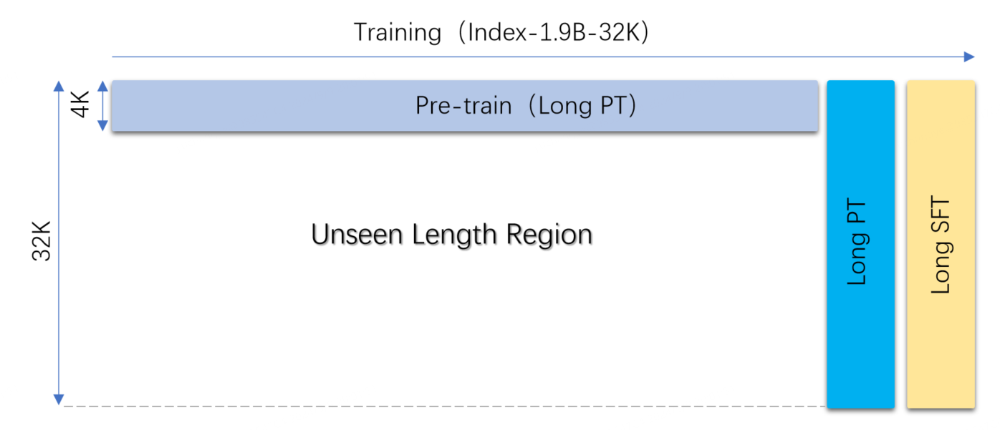
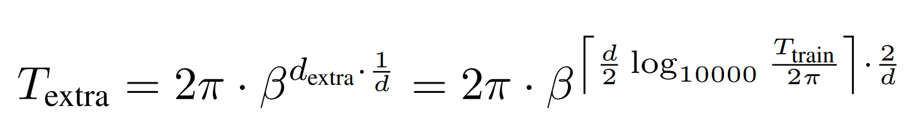
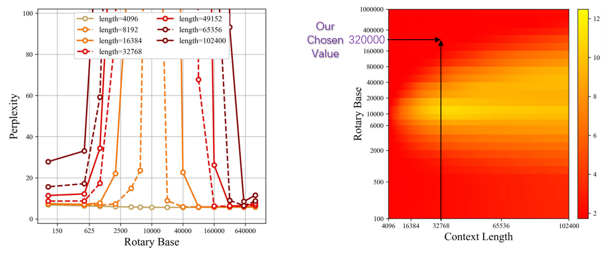
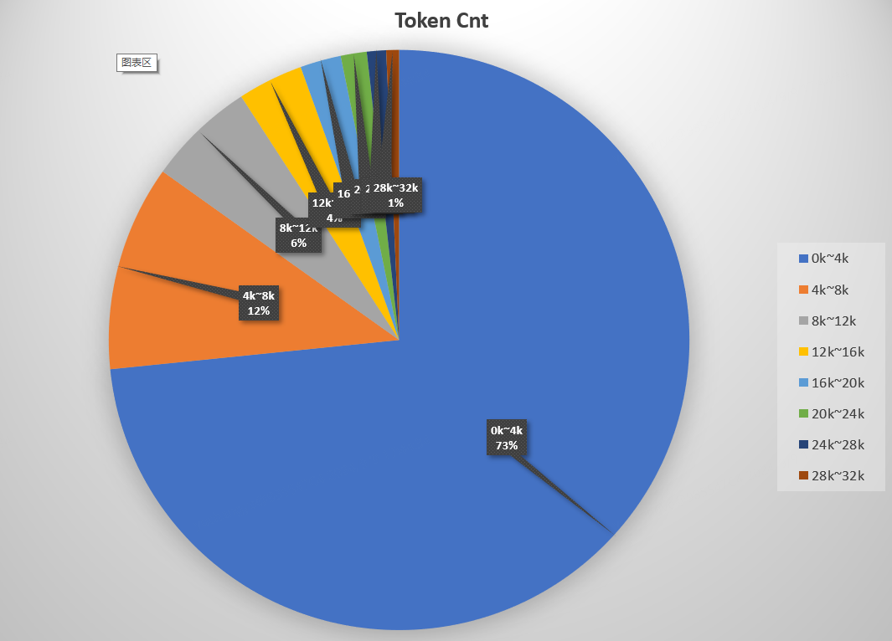
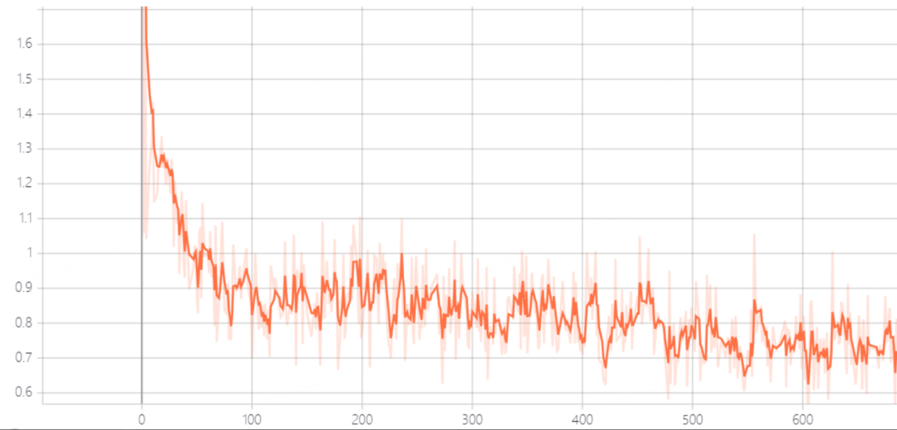
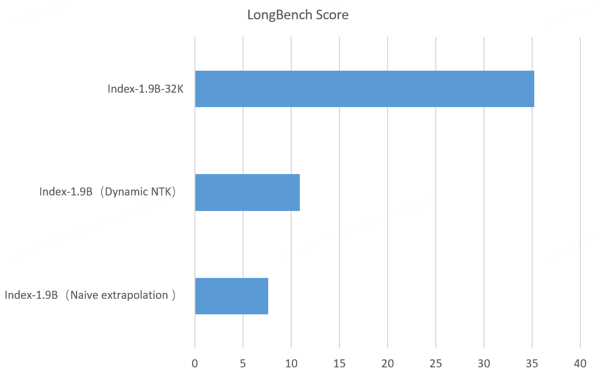
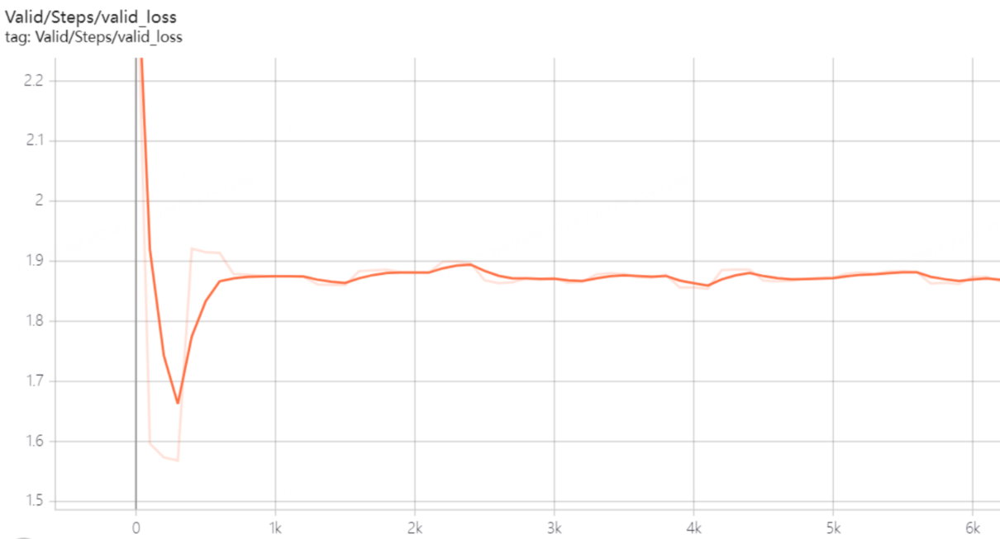

<div align="center">

  <h1>
    <font size="6">Index-1.9B-32K长上下文技术报告</font>
  </h1>

---
[Switch to English](https://github.com/bilibili/Index-1.9B/blob/main/Index-1.9B-32K_Long_Context_Technical_Report.md) 
</div>

---


# 模型和简介

## Index-1.9B-32K 简介

Index-1.9B-32K 是一个仅有 1.9B 参数、却具备 32K 上下文长度的语言模型（这意味着，这个超小精灵可以一次性读完 3.5 万字以上的文档）。该模型专门针对 32K 以上的长文本进行了持续预训练（Continued Pre-Training）和监督微调（SFT），主要基于我们精心清洗的长文本预训练语料、自建的长文本指令集进行训练。目前，我们已在 Hugging Face 和 ModelScope 上同步开源。

Index-1.9B-32K 以极小的模型体积（约为 GPT-4 等模型的 2%），实现了出色的长文本处理能力。如下图，我们1.9B尺寸的模型分数甚至远超7B尺寸的模型。以下为与 GPT-4、Qwen2等模型的对比：
<p align="center">
    
</p>
<p align="center"><strong>Index-1.9B-32K与GPT-4、Qwen2等模型长文本能力对比 </strong></p>


## 模型和代码下载：
- Huggingface：<https://huggingface.co/IndexTeam/Index-1.9B-32K>
- Modelscope：<https://modelscope.cn/models/IndexTeam/Index-1.9B-32K>
- Github：https://github.com/bilibili/Index-1.9B  （这里是：技术报告、运行&评测代码，模型运行、评测代码已开源，**可以复现**我们的评测结果，详见：[评测运行方法](evaluate/README.md)）


# 训练过程

Index-1.9B-32K基于我们已经开源的 Index-1.9B 进行继续训练，进行了额外两个阶段的训练：
1. **Long PT**：Long continued Pre-Training，长文本继续预训练，基于长数据进行持续预训练。
2. **Long SFT**：长文本监督微调，基于长指令进行 SFT。
 
   **\*(RLHF / DPO)**：尽管我们已经具备强化学习(RLHF)、DPO 等对齐训练的经验，但是这个版本还未经过RLHF/DPO训练（后续版本将补充RLHF/DPO），我们仍然优先集中精力攻克模型在长文本处理方面的深层次能力。

Index-1.9B-32K的训练流程如下：
<p align="center">
    
</p>
<p align="center"><strong> Index-1.9B-32K的训练流程</strong></p>


## 超参数

### 模型参数
- Rope Base：32 \* 10000
- 最大序列长度：32768
- 最大位置编码：32768

### Rope Base 的确定

- 我们通过理论计算并结合之前的研究工作确定了 Rope Base 的范围，详见：[2104.09864](https://arxiv.org/pdf/2104.09864) 和 [2310.05209](https://arxiv.org/pdf/2310.05209)。
- 进一步，我们通过实际训练和对照实验，最终确定了 32\*10000 这个 Rope Base。

- 我们也注意到很多其他公司使用百万甚至更高的 Rope Base，例如，Gradient AI 使用的 Rope Base 甚至超过了 10 亿，因此我们也尝试将 Rope Base 增大到数百万，经过对照实验，结果显示这并不会带来性能提升。


- Rope Base 的计算：
<p align="center">
    
</p>
<p align="center"><strong> </strong></p>


- Rope Base 和 Context Length 取值：如下图所示，在 32K 上下文情况下，32\*10000 的 Rope Base 已经足够，处于图中的红色区域，困惑度较低。
<p align="center">
    
</p>
<p align="center"><strong>Rope Base与困惑度关系 </strong></p>


## 阶段1：继续预训练（32K）

### 训练

我们基于自建的长文本语料库进行了持续预训练。我们精心清洗了 100B+ 的长文本数据，在训练了 10B 之后，模型的长文本性能提升已比较显著。

### 训练参数

- 为了有效利用算力，使用Doc Packing方式训练，并重置注意力掩码和位置 ID
- Token 级别的 Batch Size 为 4M
- 峰值学习率为 1e-5
- 学习率调度：余弦调度，开始时进行少量预热
- 权重衰减：0.1
- 梯度裁剪：1.0

### 长文本语料
我们基于自建的海量语料池，构建了长文本预训练语料库。互联网上搜集到的大多数语料的 Token 量比较短，我们进行了统计如下：

- 73% 的文档的 Token 量处于 0~4K 之内。
- 32K以上的长文本语料不足 1%。
<p align="center">
    
</p>
<p align="center"><strong>我们的语料库 Token 长度分布 </strong></p>


## 阶段2：SFT（32K）

### 训练

- 我们基于 3 万多条自建的长文本指令，并结合 5 万多条通用指令进行了 SFT，使模型具备了长文本指令遵循能力。我们也尝试使用数十万条指令进行训练，但结果没有显著变化，这一方面源于我们的指令的质量和多样性仍不佳。
- 在我们多次实验中，通常 2 个 epoch 就能达到较好的性能。
- SFT 过程的训练集损失下降曲线如下，可以看到模型在前 100 步内性能急剧提升。

<p align="center">
    
</p>
<p align="center"><strong>SFT 训练损失曲线 </strong></p>

### 训练参数

- 为了有效利用算力，使用Doc Packing方式训练，并重置注意力掩码和位置 ID
- Token 级别的 Batch Size 为 1M
- 峰值学习率为 5e-6
- 学习率调度：余弦调度，开始时进行少量预热
- 权重衰减：0.1
- 梯度裁剪：1.0

# 评测

- 对于模型的“长文本能力”，我们使用了三种评测方法：NeedleBench、LongBench 和 LEval。
- 对于模型的“短文本能力”，我们使用了自建的评测集和 MMLU 等传统评测方法。
- 评测主要基于 [opencompass](https://github.com/open-compass/opencompass) 完成。 
- **OpenCompass** 提供了便捷且丰富的大模型评测支持，这极大地提升了我们模型的训练迭代节奏，在此特别鸣谢。
- 我们的模型运行、评测代码也已开源，**可以复现**我们的评测结果，详见：[评测运行方法](evaluate/README.md)）


## 评测方法和结果

### NeedleBench（大海捞针）
- Index-1.9B-32K在32K长度的大海捞针测试下，评测结果如下图（needlebench_single_32k），可以看到，评测结果只在（32K 长度，%10 深度）区域有一处黄斑（91.08分），其他范围表现优异，几乎全绿。
- 大海捞针测试简介：[大海捞针测试](https://opencompass.readthedocs.io/zh-cn/latest/advanced_guides/needleinahaystack_eval.html)通过在长文本中随机插入关键信息，形成大型语言模型 (LLM) 的 Prompt，旨在检测大型模型是否能从长文本中提取出这些关键信息，从而评估模型处理长文本信息提取的能力。
<p align="center">
    
</p>
<p align="center"><strong>大海捞针评测 </strong></p>

### LongBench和LEval
- Index-1.9B-32K在 LongBench 评测上的得分为 35.23，在 LEval 评测上的得分为 35.86。[详细分数请点击](#评测分数明细)
- LongBench简介：[LongBench](https://github.com/THUDM/LongBench)是由 THUDM 构建的长文本数据集，由 21 个子任务构成，总计 4750 条测例。该数据集是第一个包含中英双语的长文本数据集，其中英语文本长度平均为 6711 词，中文文本平均长度为 13386 字。
- LEval简介：[LEval](https://github.com/OpenLMLab/LEval)是由 OpenLMLab 构建的一个长文本数据集，由 18 个子任务组成，其中包含法律、经济、科技等各个领域的文本。
- 如下图，我们1.9B尺寸的模型分数甚至远超7B尺寸的模型：
<p align="center">
    
</p>
<p align="center"><strong>Index-1.9B-32K与GPT-4、Qwen2等模型长文本能力对比 </strong></p>


## Alignment评测和短能力
- 虽然Index-1.9B-32K的长文本能力获得极其优异的结果，但短文本能力有所下降。
- 我们使用了基于自建 benchmark 的评测，结果显示模型的“短文本能力”在多个评测指标上均有下降。在自建 benchmark 的评测中，性能下降了约 25%，因此，平衡模型的“长短文本能力”也将是我们未来的一个主要工作。

## 对 OpenCompass 的优化

在进行长上下文相关的评测时，我们遇到以下问题并进行了优化，这一优化已被 OpenCompass 合并到官方最新仓库，详见：
[opencompass/commit](https://github.com/open-compass/opencompass/commit/59586a8b4a3e4dc2c24b6e55a3d1074e5fbe10ab?diff=unified&w=0)

### 问题

在评估过程中，序列长度可能会超过模型的 max_seq_len，尤其是在长上下文评估中，这导致两个问题：

1. prompt被截断，只有一部分进入模型，导致关键信息（例如关键问题）丢失，模型无法理解prompt的意图。
2. 在继续生成时，总长度超过max_seq_len 并出现以下警告：

    > This is a friendly reminder - the current text generation call will exceed the model's predefined maximum length (32768). Depending on the model, you may observe exceptions, performance degradation, or nothing at all.

### 解决方案

保留前 0.5 \* max_prompt_len 的 tokens 和后 0.5 \* max_prompt_len 的 tokens，丢弃中间部分，因为提示中的问题通常位于开头或结尾。

# 对其他上下文扩展技术的研究

## 对比：Index-1.9B-32K、Dynamic NTK 和 Naive Extrapolation

我们对比了免训练的上下文扩展方法，例如 Dynamic NTK 等。其中，我们对 Dynamic NTK 使用了多种 scaling factor，本文评测时使用的 scaling factor 为 8。

<p align="center">
    
</p>
<p align="center"><strong> Long Context方法效果对比</strong></p>

# 讨论

- 总体来看，在 1.9B 这个模型尺寸下，我们相比业界其他同尺寸开源模型取得了非常优异的结果。我们也公开了 benchmark 运行代码，可以复现这些评测结果。
- 通过大量研究和实验发现，长文本能力和短文本能力在很多情况下像跷跷板，兼顾两者是一个有趣且具有挑战性的课题。


**我们还进行了很多失败的尝试，例如：**

## 上下文长度预热（Context Length Warmup）

我们最初认为 LLM 对文本长度的感知能力应当逐步从短到长提升，因此尝试构建长度递增的数据集并按顺序进行训练。模型的损失（Loss）在初期下降迅速，但随后出现反弹且无法进一步下降。我们推测这可能与数据分布不均有关，后续将对此展开更深入的研究。

<p align="center">
    
</p>
<p align="center"><strong> 上下文长度预热训练的验证集损失曲线</strong></p>


## Packing VS Non-Packing

我们认为Doc Packing 方式的训练可能会影响梯度下降，特别是在混合不同长度指令时。然而，实验结果显示，两种训练方式的差异极小（小于 1%）。

## 1‰ 长指令 SFT

我们注意到 LLaMA 3 的Paper中提到他们只使用了 1‰ 的长指令进行微调，我们对这一结果感到好奇，于是进行了实验，实验结果为负向。


# 评测分数明细

## LEval 

详细得分如下表：
- GPT-4和longchat-7b-v1.5-32k的得分摘自
[这里](https://opencompass.readthedocs.io/zh-cn/latest/advanced_guides/longeval.html#l-eval)
- Index-1.9B-32K、Qwen2-1.5B-Instruct的得分是我们基于opencompass运行得出

| **Dataset**                        | **Index-1.9B-32K** | **Qwen2-1.5B-Instruct** | **longchat-7b-v1.5-32k** | **GPT-4**   |
|---------------------------------|----------------|---------------------|----------------------|---------|
| **LEval Exact Match (Acc)**         | 41.542         | 46.412              | 21.008               | 81.434  |
| LEval_coursera                  | 41.28          | 45.93               | 27.91                | 61.05   |
| LEval_gsm100                    | 27             | 42                  | 5                    | 92      |
| LEval_quality                   | 50             | 44.55               | 29.7                 | 81.19   |
| LEval_tpo                       | 65.43          | 66.91               | 17.1                 | 72.93   |
| LEval_topic_retrieval           | 24             | 32.67               | 25.33                | 100     |
| **LEval Gen (ROUGE)**               | 30.17461538    | 32.33692308         | 26.80076923          | 41.53923077 |
| LEval_financialqa               | 39.97          | 41.23               | 34.07                | 53.49   |
| LEval_gov_report_summ           | 40.77          | 37.43               | 36.52                | 50.84   |
| LEval_legal_contract_qa         | 14.02          | 28.07               | 13.32                | 31.23   |
| LEval_meeting_summ              | 28.54          | 27.43               | 22.32                | 31.44   |
| LEval_multidocqa                | 22.91          | 29.91               | 21.85                | 37.81   |
| LEval_narrativeqa               | 15.87          | 21.03               | 16.87                | 25.87   |
| LEval_nq                        | 49.02          | 34.48               | 35.02                | 67.36   |
| LEval_news_summ                 | 27.93          | 28.17               | 30.33                | 34.52   |
| LEval_paper_assistant           | 35.35          | 32.63               | 30.42                | 42.26   |
| LEval_patent_summ               | 33.6           | 47.72               | 41.6                 | 48.61   |
| LEval_review_summ               | 25.16          | 27.01               | 20.02                | 31.98   |
| LEval_scientificqa              | 34.39          | 37.63               | 20.98                | 49.76   |
| LEval_tvshow_summ               | 24.74          | 27.64               | 25.09                | 34.84   |
| **Average**                         | 35.8583    | 39.3745      | 23.9044        | 61.4866 |


## LongBench

- GPT-4和longchat-7b-v1.5-32k的得分摘自
[这里](https://opencompass.readthedocs.io/zh-cn/latest/advanced_guides/longeval.html#longbench)
- Index-1.9B-32K、Qwen2-1.5B-Instruct的得分是我们基于opencompass运行得出

| **LongBench**              | **Index-1.9B-32K** | **Qwen2-1.5B-Instruct** | **longchat-7b-v1.5-32k** | **GPT-4**   |
|------------------------|----------------|---------------------|----------------------|---------|
| **Single-Document QA**      | 37.305         | 32.72               | 31.625               | 48.3675 |
| NarrativeQA             | 19.1           | 15.93               | 19.19                | 31.2    |
| Qasper                 | 32.47          | 29.3                | 30.36                | 42.77   |
| MultiFieldQA-en         | 43.23          | 40.74               | 44.6                 | 55.1    |
| MultiFieldQA-zh         | 54.42          | 44.91               | 32.35                | 64.4    |
| **Multi-Document QA**       | 25.9375        | 24.04               | 22.54                | 50.8875 |
| HotpotQA               | 33.83          | 30.09               | 34.43                | 59.85   |
| 2WikiMQA               | 26.87          | 22.57               | 23.06                | 67.52   |
| Musique                | 16.21          | 15.12               | 12.42                | 37.53   |
| DuReader (zh)           | 26.84          | 28.38               | 20.25                | 38.65   |
| **Summarization**           | 17.46          | 17.015              | 23.025               | 25.13   |
| GovReport              | 17.3           | 18.63               | 29.83                | 32.09   |
| QMSum                  | 17.97          | 18.41               | 22.71                | 24.37   |
| Multi_news             | 15.66          | 15.19               | 26.1                 | 28.52   |
| VCSUM (zh)             | 18.91          | 15.83               | 13.46                | 15.54   |
| **Few-shot Learning**       | 51.0425        | 30.6725             | 34.6625              | 64.6275 |
| TREC                   | 59.5           | 8                   | 29.23                | 78.5    |
| TriviaQA               | 83.87          | 74.46               | 64.19                | 92.19   |
| SAMSum                 | 34.3           | 29.23               | 25.23                | 46.32   |
| LSHT (zh)              | 26.5           | 11                  | 20                   | 41.5    |
| **Synthetic Tasks**         | 15.333    | 7.98                | 12.167          | 59.833 |
| Passage Count           | 0              | 5                   | 1                    | 8.5     |
| PassageRetrieval-en     | 24             | 11.94               | 20.5                 | 75      |
| PassageRetrieval-zh     | 22             | 7                   | 15                   | 96      |
| **Code Completion**         | 64.335         | 29.91               | 51.82                | 57.335  |
| LCC                    | 66.4           | 34.14               | 51.46                | 59.25   |
| RepoBench-P            | 62.27          | 25.68               | 52.18                | 55.42   |
| **Average**             | 35.2356   | 23.7229        | 29.3065      | 51.0301 |


## 其他Long Context技术研究对比：基于两阶段训练、Dynamic NTK、Naive Extrapolation

| **LongBench**        | **Index-1.9B-32K** | **Index-1.9B-4K** | **Index-1.9B-4K Dynamic NTK** |
|----------------------|--------------------|-------------------|-------------------------------|
| **Average**          | **35.23**           | **7.65**          | **10.9**                      |
| Single-Document QA   | 37.305              | 12.47             | 12.03                         |
| NarrativeQA          | 19.1                | 0.09              | 0.98                          |
| Qasper               | 32.47               | 11.48             | 7.68                          |
| MultiFieldQA-en      | 43.23               | 12.76             | 17.07                         |
| MultiFieldQA-zh      | 54.42               | 25.53             | 22.39                         |
| Multi-Document QA    | 25.9375             | 2.33              | 5.31                          |
| HotpotQA             | 33.83               | 0.7               | 3.44                          |
| 2WikiMQA             | 26.87               | 5.59              | 11.4                          |
| Musique              | 16.21               | 0.07              | 1.64                          |
| DuReader (zh)        | 26.84               | 2.97              | 4.76                          |
| Summarization        | 17.46               | 5.26              | 7.57                          |
| GovReport            | 17.3                | 1.65              | 9.49                          |
| QMSum                | 17.97               | 0.1               | 1.73                          |
| Multi_news           | 15.66               | 13.05             | 10.08                         |
| VCSUM (zh)           | 18.91               | 6.24              | 8.98                          |
| Few-shot Learning    | 51.0425             | 3.82              | 3.18                          |
| TREC                 | 59.5                | 1.5               | 2.5                           |
| TriviaQA             | 83.87               | 9.2               | 4.57                          |
| SAMSum               | 34.3                | 4.56              | 2.4                           |
| LSHT (zh)            | 26.5                | \-                | 3.25                          |
| Synthetic Tasks      | 15.3333             | 0.55              | 1.11                          |
| Passage Count        | 0                   | \-                | 0.22                          |
| PassageRetrieval-en  | 24                  | 0.07              | 1.95                          |
| PassageRetrieval-zh  | 22                  | 1.57              | 1.17                          |
| Code Completion      | 64.335              | 21.46             | 36.21                         |
| LCC                  | 66.4                | 37.39             | 35.41                         |
| RepoBench-P          | 62.27               | 5.52              | 37                            |


# Index-1.9B-32K 使用方法

##  环境配置

1. 下载模型运行、评测的代码仓库:

```shell
git clone https://github.com/bilibili/Index-1.9B
cd Index-1.9B
```
2. 下载模型文件到本地:
[模型下载地址](#模型和代码下载)


3. 使用pip安装依赖环境:

```shell
pip install -r requirements.txt
```

## 终端运行Demo
- 运行长文本**专用**的交互工具：**demo/cli_long_text_demo.py** （**注意: `Index-1.9B-32K` 仅限使用此工具启动**）
- 模型默认会读取该文件：data/user_long_text.txt，将对文本内容进行中文总结。
- 可以新建一个窗口，实时修改文件内容，模型会读取最新的文件内容并总结。

```shell
cd demo/
CUDA_VISIBLE_DEVICES=0 python cli_long_text_demo.py --model_path '/path/to/model/' --input_file_path data/user_long_text.txt
```
- 运行&交互效果（翻译并总结哔哩哔哩公司于2024.8.22发布的英文财报  --- [英文财报原文在这里](https://github.com/bilibili/Index-1.9B/tree/main/demo/data/user_long_text.txt))：
<p align="center">
    
</p>
<p align="center"><strong> 翻译总结（哔哩哔哩公司于2024.8.22发布的英文财报）</strong></p>

- **效果调优**：正如在上文[训练过程](#训练过程)一节所述——“此版本模型尚未经过 RLHF/DPO 的对齐训练（后续版本将补充 RLHF/DPO）”，因此其在不同任务上的指令遵循能力可能不足。如果在你的任务中测试效果不理想，建议尝试修改 cli_long_text_demo.py 中的 prompt 以优化任务表现。
- **仅限用于长文本**：如上文[Alignment评测和短能力](#评测)一节所述，此版本模型在长文本处理方面表现出色，但短文本能力（如普通聊天对话）有所下降。如果你主要用于普通的对话，建议使用我们的另一个版本[Index-1.9B-Chat](https://github.com/bilibili/Index-1.9B)


# 写在最后

本文对我们的 Long Context 工作做了简略介绍，我们仍在持续更新、升级 Long Context 能力，请关注后续进展，欢迎交流。

## 局限性与免责申明

Index-1.9B-32K在某些情况下可能会产生不准确、有偏见或其他令人反感的内容。模型生成内容时无法理解、表达个人观点或价值判断，其输出内容不代表模型开发者的观点和立场。因此，请谨慎使用模型生成的内容，用户在使用时应自行负责对其进行评估和验证，请勿将生成的有害内容进行传播，且在部署任何相关应用之前，开发人员应根据具体应用对模型进行安全测试和调优。

我们强烈警告不要将这些模型用于制造或传播有害信息，或进行任何可能损害公众、国家、社会安全或违反法规的活动，也不要将其用于未经适当安全审查和备案的互联网服务。我们已尽所能确保模型训练数据的合规性，但由于模型和数据的复杂性，仍可能存在无法预见的问题。如果因使用这些模型而产生任何问题，无论是数据安全问题、公共舆论风险，还是因模型被误解、滥用、传播或不合规使用所引发的任何风险和问题，我们将不承担任何责任。

## 模型开源协议

使用本仓库的源码需要遵循 [[Apache-2.0]{.underline}](https://github.com/bilibili/Index-1.9B/blob/main/LICENSE) 开源协议，使用
Index-1.9B-32K的模型权重则需要遵循[[模型许可协议]{.underline}](https://github.com/bilibili/Index-1.9B/blob/main/INDEX_MODEL_LICENSE)。

Index-1.9B-32K模型权重对学术研究**完全开放**，并且支持**免费商用**。

## 引用

如果你觉得我们的工作对你有帮助，欢迎引用！

```shell
@article{Index-1.9B-32K,
        title={Index-1.9B-32K Long Context Technical Report},
        year={2024},
        url={https://github.com/bilibili/Index-1.9B/blob/main/Index-1.9B-32K_Long_Context_Technical_Report.md},
        author={Changye Yu, Tianjiao Li, Lusheng Zhang and IndexTeam}
}
```
