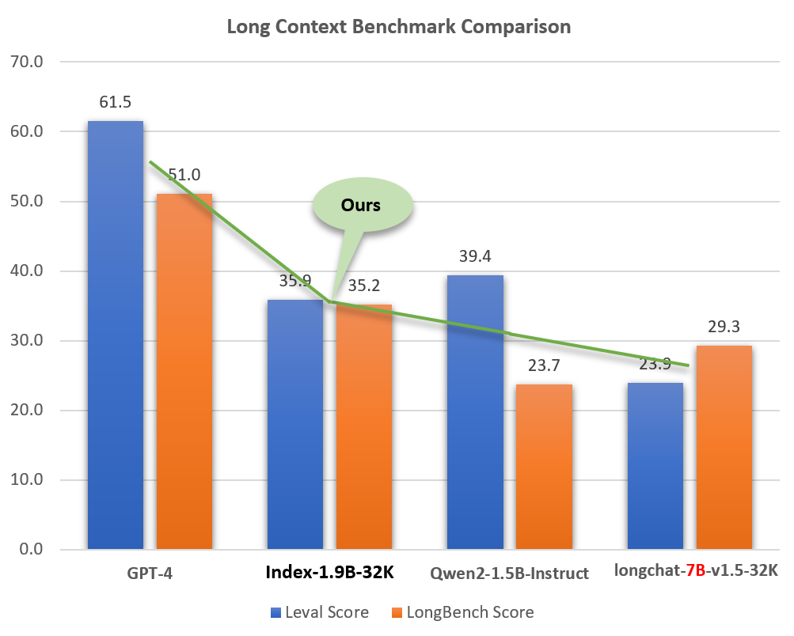

<div align="center">
<h1>
  Index-1.9B
</h1>
</div>
<p align="center">
  <a href="./README_zh.md" target="_blank">切换到中文</a> |
  Online:
  <a href="https://huggingface.co/spaces/IndexTeam/Index-1.9B" target="_blank">Chat</a> and
  <a href="https://huggingface.co/spaces/IndexTeam/Index-1.9B-Character" target="_blank">Role-playing</a> |
  QQ: <a href="media/group_qrcode.jpg" target="_blank">QQ Group</a> 
</p>

### Recent Updates  :star2:
1. Open-source 32K long-context model Index-1.9B-32K. Details: 📖 [Index-1.9B-32K_Long_Context_Technical_Report.md](https://github.com/bilibili/Index-1.9B/blob/main/Index-1.9B-32K_Long_Context_Technical_Report.md)
2. Adapted to llamacpp and Ollama, see [Index-1.9B-Chat-GGUF](https://huggingface.co/IndexTeam/Index-1.9B-Chat-GGUF)
3. Open source Checkpoint before Decay available for research, see [Index-1.9B-Constant-LR](https://huggingface.co/IndexTeam/Index-1.9B-Constant-LR)

## Model Introduction

The Index-1.9B series is a lightweight version of the Index series models, including the following models:
- Index-1.9B base: Base model with 1.9 billion non-embedding parameters, pre-trained on 2.8T mainly Chinese and English corpus, leading in multiple evaluation benchmarks compared to models of the same level.
- Index-1.9B pure: Control version of the base model with the same parameters and training strategy, but strictly filtered out all instruction-related data from the corpus to verify the impact of instructions on benchmarks.
- Index-1.9B chat: A dialogue model aligned with SFT and DPO based on the index-1.9B base. We found that due to the introduction of a lot of internet community corpus in our pre-training, the model has significantly more interesting chat capabilities and strong multilingual (especially East Asian languages) translation abilities compared to models of the same level.
- Index-1.9B character: Introduces RAG on top of SFT and DPO to achieve <b>fewshots role-playing</b> customization.
- Index-1.9B-32K: Index-1.9B-32K is a language model with only 1.9B parameters, but it supports a 32K context length (meaning this extremely, extremely small model can read documents of over 35,000 words in one go).

## Evaluation Results

|Model|Average score|Average English score|MMLU|CEVAL|CMMLU|HellaSwag|Arc-C|Arc-E|
|----|----|----|----|----|----|----|----|----|
|Google Gemma 2B|41.58|46.77|41.81|31.36|31.02|66.82|36.39|42.07|
|Phi-2 (2.7B)|58.89|**72.54**|57.61|31.12|32.05|70.94|74.51|87.1|
|Qwen1.5-1.8B|58.96|59.28|47.05|59.48|57.12|58.33|56.82|74.93|
|Qwen2-1.5B(report)|**65.17**|62.52 |56.5|70.6|70.3|66.6|43.9|83.09|
|MiniCPM-2.4B-SFT|62.53|68.75|53.8|49.19|50.97|67.29|69.44|84.48|
|**Index-1.9B-Pure**|50.61 |52.99 |46.24|46.53|45.19|62.63|41.97|61.1|
|**Index-1.9B**|**64.92** |**69.93**|52.53|57.01|52.79|80.69|65.15|81.35|
|Llama2-7B|50.79|60.31|44.32|32.42|31.11|76|46.3|74.6|
|Mistral-7B (report) |/|**69.23**|60.1|/|/|81.3|55.5|80|
|Baichuan2-7B|54.53|53.51|54.64|56.19|56.95|25.04|57.25|77.12|
|Llama2-13B|57.51|66.61|55.78|39.93|38.7|76.22|58.88|75.56|
|Baichuan2-13B|68.90|71.69|59.63|59.21|61.27|72.61|70.04|84.48|
|MPT-30B (report)|/|63.48|46.9|/|/|79.9|50.6|76.5|
|Falcon-40B (report)|/|68.18|55.4|/|/|83.6|54.5|79.2|

Evaluation code is based on [OpenCompass](https://github.com/open-compass/opencompass) with compatibility modifications. See the [evaluate](./evaluate/) folder for details.

## Model Download

| HuggingFace   | ModelScope  |
|:-------:|:-------:|
| 🤗 [Index-1.9B-Chat](https://huggingface.co/IndexTeam/Index-1.9B-Chat) |[Index-1.9B-Chat](https://modelscope.cn/models/IndexTeam/Index-1.9B-Chat) |
| 🤗 [Index-1.9B-Character](https://huggingface.co/IndexTeam/Index-1.9B-Character) (Role-playing)| [Index-1.9B-Character](https://modelscope.cn/models/IndexTeam/Index-1.9B-Character) (Role-playing)|
| 🤗 [Index-1.9B-Base](https://huggingface.co/IndexTeam/Index-1.9B) | [Index-1.9B-Base](https://modelscope.cn/models/IndexTeam/Index-1.9B) |
| 🤗 [Index-1.9B-Base-Pure](https://huggingface.co/IndexTeam/Index-1.9B-Pure) |  [Index-1.9B-Base-Pure](https://modelscope.cn/models/IndexTeam/Index-1.9B-Pure) 
| 🤗 [Index-1.9B-32K](https://huggingface.co/IndexTeam/Index-1.9B-32K) (32K Long Context)|  [Index-1.9B-32K](https://modelscope.cn/models/IndexTeam/Index-1.9B-32K) (32K Long Context)

## Usage Instructions
-  **Note: `Index-1.9B-32K` can only be launched using this tool: `demo/cli_long_text_demo.py`!!!**
### Environment Setup

1. Download this repository:

```shell
git clone https://github.com/bilibili/Index-1.9B
cd Index-1.9B
```

2. Install dependencies using pip:

```shell
pip install -r requirements.txt
```
### Loading with Transformers

You can load the Index-1.9B-Chat model for dialogue using the following code:

```python
import argparse
from transformers import AutoTokenizer, pipeline

# Attention! The directory must not contain "." and can be replaced with "_".
parser = argparse.ArgumentParser()
parser.add_argument('--model_path', default="./IndexTeam/Index-1.9B-Chat/", type=str, help="")
parser.add_argument('--device', default="cpu", type=str, help="") # also could be "cuda" or "mps" for Apple silicon
args = parser.parse_args()

tokenizer = AutoTokenizer.from_pretrained(args.model_path, trust_remote_code=True)
generator = pipeline("text-generation",
                    model=args.model_path,
                    tokenizer=tokenizer, trust_remote_code=True, 
                    device=args.device)


system_message = "你是由哔哩哔哩自主研发的大语言模型，名为“Index”。你能够根据用户传入的信息，帮助用户完成指定的任务，并生成恰当的、符合要求的回复。"
query = "续写 天不生我金坷垃"
model_input = []
model_input.append({"role": "system", "content": system_message})
model_input.append({"role": "user", "content": query})

model_output = generator(model_input, max_new_tokens=300, top_k=5, top_p=0.8, temperature=0.3, repetition_penalty=1.1, do_sample=True)

print('User:', query)
print('Model:', model_output)
```

### Web Demo

Depends on Gradio, install with:
```shell
pip install gradio==4.29.0
```
Start a web server with the following code. After entering the access address in the browser, you can use the Index-1.9B-Chat model for dialogue:
```shell
python demo/web_demo.py --port='port' --model_path='/path/to/model/'
```


### Terminal Demo
 **Note: `Index-1.9B-32K` can only be launched using this tool: `demo/cli_long_text_demo.py`!!!**

Start a terminal demo with the following code to use the Index-1.9B-Chat model for dialogue:
```shell
python demo/cli_demo.py  --model_path='/path/to/model/'
```

### Openai Api Demo

Depends on Flask, install with:
```shell
pip install flask==2.2.5
```
Start a Flask API with the following code:
```shell
python demo/openai_demo.py --model_path='/path/to/model/'
```
You can conduct dialogues via command line:
```shell
curl http://127.0.0.1:8010/v1/chat/completions \
    -H "Content-Type: application/json" \
    -d '{
    "messages": [
    {"role": "system", "content": "你是由哔哩哔哩自主研发的大语言模型，名为“Index”。你能够根据用户传入的信息，帮助用户完成指定的任务，并生成恰当的、符合要求的回复。"},
    {"role": "user", "content": "花儿为什么这么红？"}
    ]
    }'
```

# Index-1.9B-32K Long Context Model Introduction
## Model Overview
Index-1.9B-32K is a language model with only 1.9 billion parameters, yet it supports a context length of 32K (meaning this extremely small model can read documents of over 35,000 words in one go). The model has undergone Continue Pre-Training and Supervised Fine-Tuning (SFT) specifically for texts longer than 32K tokens, based on carefully curated long-text training data and self-built long-text instruction sets. The model is now open-source on both Hugging Face and ModelScope.

Despite its small size (about 2% of models like GPT-4), Index-1.9B-32K demonstrates excellent long-text processing capabilities. 
As shown in the figure below, our 1.9B-sized model's score even surpasses that of the 7B-sized model. Below is a comparison with models like GPT-4 and Qwen2:

<p align="center">  
</p> <p align="center"><strong>Comparison of Index-1.9B-32K with GPT-4, Qwen2, and other models in Long Context capability</strong>
</p>

In a 32K-length needle-in-a-haystack test, Index-1.9B-32K achieved excellent results, as shown in the figure below. The only exception was a small yellow spot (91.08 points) in the region of (32K length, 10% depth), with all other areas performing excellently in mostly green zones.
<p align="center">
    
</p>
<p align="center"><strong>NeedleBench Evaluation</strong></p>

## Index-1.9B-32K Model Download, Usage, and Technical Report:
For details on downloading, usage, and the technical report for Index-1.9B-32K, see:

<a href="https://github.com/bilibili/Index-1.9B/blob/main/Index-1.9B-32K_Long_Context_Technical_Report.md" style="color: blue;">
    📖 <strong>Index-1.9B-32K Long Context Technical Report</strong>
</a>

---
---
# Details and Disclaimer for the Index Series Models
## Index-1.9B-Chat Output Examples

- Below are some examples using `web_demo.py` to get Index-1.9B-Chat outputs.
    
    
- Change the `System Message` to role-play a stereotype of bilibili user!
    
- Translate Chinese to Japanese
    
- Translate Japanese to Chinese 
    

## Role Playing
We have simultaneously open-sourced the role-playing model and the accompanying framework.


* We currently have the character `三三` built-in.
* If you need to create your own character, please prepare a dialogue corpus similar to [roleplay/character/三三.csv](roleplay/character/三三.csv) (note that the file name should match the name of the character you want to create) and a corresponding character description. Click `生成角色` to create it successfully.
* If the corresponding character has already been created, please directly enter the character you want to converse with in the `Role name` field, input your `query`, and click `submit` to start the conversation.

For detailed usage, please refer to the [roleplay](./roleplay) folder.

## Long Text Translation and Summary（Index-1.9B-32K）
- Run the interactive tool for long text: **demo/cli_long_text_demo.py**
- The model will, by default, read this file: data/user_long_text.txt and summarize the text in Chinese.
- You can open a new window and modify the file content in real-time, and the model will read the updated file and summarize it.

```shell
cd demo/
CUDA_VISIBLE_DEVICES=0 python cli_long_text_demo.py --model_path '/path/to/model/' --input_file_path data/user_long_text.txt
```
- Run & Interaction Example (Translation and summarization of the Bilibili financial report released on 2024.8.22 in English --- [Original English report here](https://github.com/bilibili/Index-1.9B/tree/main/demo/data/user_long_text.txt))：

<p align="center">
    
</p>
<p align="center"><strong>Translation and Summary (Bilibili financial report released on 2024.8.22)</strong></p>


## Quantization

Depends on bitsandbytes, installation command:
```shell
pip install bitsandbytes==0.43.0
```
You can use the following script to perform int4 quantization, which has less performance loss and further saves video memory usage.
```python
import torch
import argparse
from transformers import (
    AutoModelForCausalLM,
    AutoTokenizer,
    TextIteratorStreamer,
    GenerationConfig,
    BitsAndBytesConfig
)

parser = argparse.ArgumentParser()
parser.add_argument('--model_path', default="", type=str, help="")
parser.add_argument('--save_model_path', default="", type=str, help="")
args = parser.parse_args()

tokenizer = AutoTokenizer.from_pretrained(args.model_path, trust_remote_code=True)
quantization_config = BitsAndBytesConfig(
    load_in_4bit=True,
    bnb_4bit_compute_dtype=torch.float16,
    bnb_4bit_use_double_quant=True,
    bnb_4bit_quant_type="nf4",
    llm_int8_threshold=6.0,
    llm_int8_has_fp16_weight=False,
)
model = AutoModelForCausalLM.from_pretrained(args.model_path, 
                                             device_map="auto",
                                             torch_dtype=torch.float16,
                                             quantization_config=quantization_config,
                                             trust_remote_code=True)
model.save_pretrained(args.save_model_path)
tokenizer.save_pretrained(args.save_model_path)
```

### Fine-tuning

Follow the steps in the [fine-tuning tutorial](https://github.com/bilibili/Index-1.9B/blob/main/finetune/README.md)  to quickly fine-tune the Index-1.9B-Chat model. Give it a try and customize your exclusive Index model!

## Limitations and Disclaimer

Index-1.9B may generate inaccurate, biased, or otherwise objectionable content in certain situations. The model cannot understand, express personal opinions, or make value judgments. Its outputs do not represent the views and positions of the model developers. Therefore, please use the generated content with caution. Users should independently evaluate and verify the content generated by the model and should not disseminate harmful content. Developers should conduct safety tests and fine-tuning according to specific applications before deploying any related applications.

We strongly advise against using these models to create or disseminate harmful information or engage in activities that may harm public, national, or social security or violate regulations. Do not use the models for internet services without proper safety review and filing. We have made every effort to ensure the compliance of the training data, but due to the complexity of the model and data, unforeseen issues may still exist. We will not be held responsible for any problems arising from the use of these models, whether related to data security, public opinion risks, or any risks and issues caused by misunderstanding, misuse, dissemination, or non-compliant use of the model.

## Model Open Source License

Using the source code from this repository requires compliance with the [Apache-2.0](LICENSE). The use of the Index-1.9B model weights requires compliance with the [INDEX_MODEL_LICENSE](INDEX_MODEL_LICENSE).

The Index-1.9B model weights are **fully open** for academic research and support **free commercial use**.

## Citation
If you think our work is helpful to you, please feel free to cite it!

```
@article{Index,
  title={Index1.9B Technical Report},
  year={2024}
}
```
## Extended Works
libllm: https://github.com/ling0322/libllm/blob/main/examples/python/run_bilibili_index.py

chatllm.cpp：https://github.com/foldl/chatllm.cpp/blob/master/docs/rag.md#role-play-with-rag

ollama：https://ollama.com/milkey/bilibili-index

self llm: https://github.com/datawhalechina/self-llm/blob/master/bilibili_Index-1.9B/04-Index-1.9B-Chat%20Lora%20微调.md
