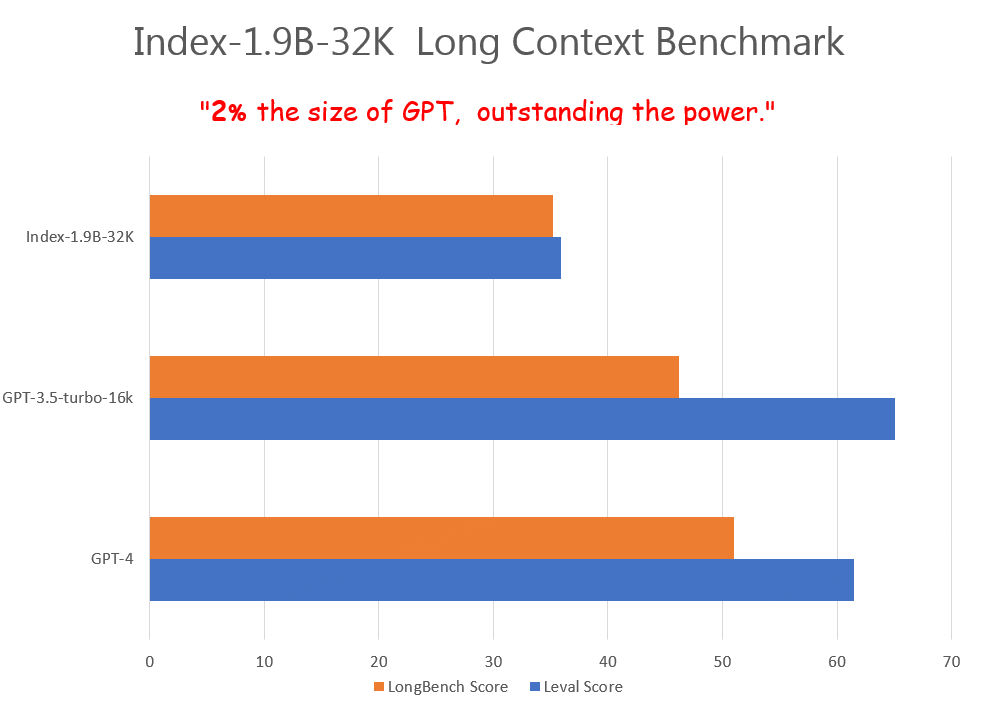
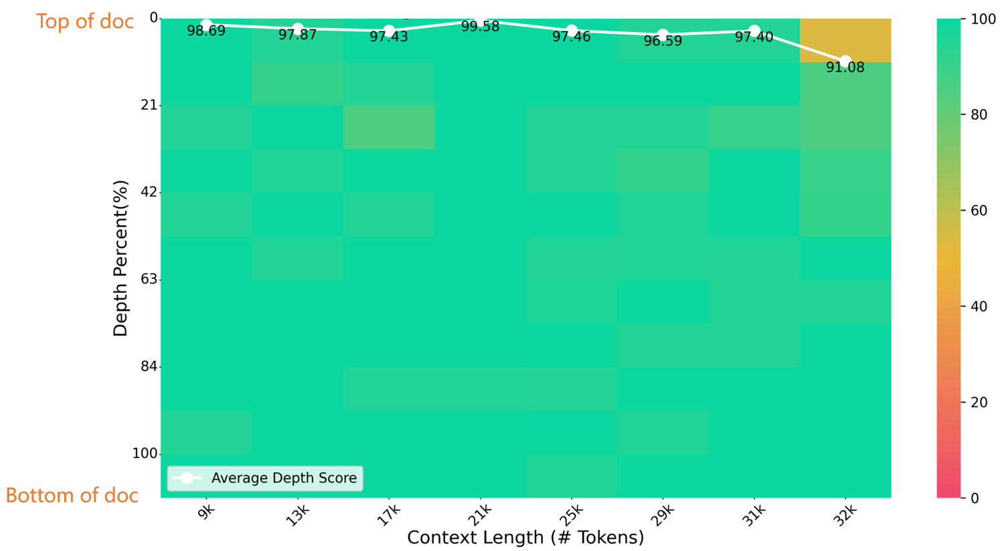
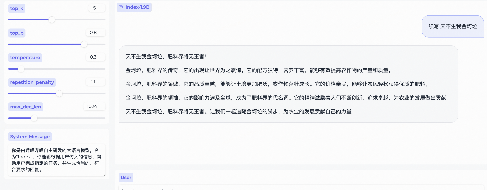
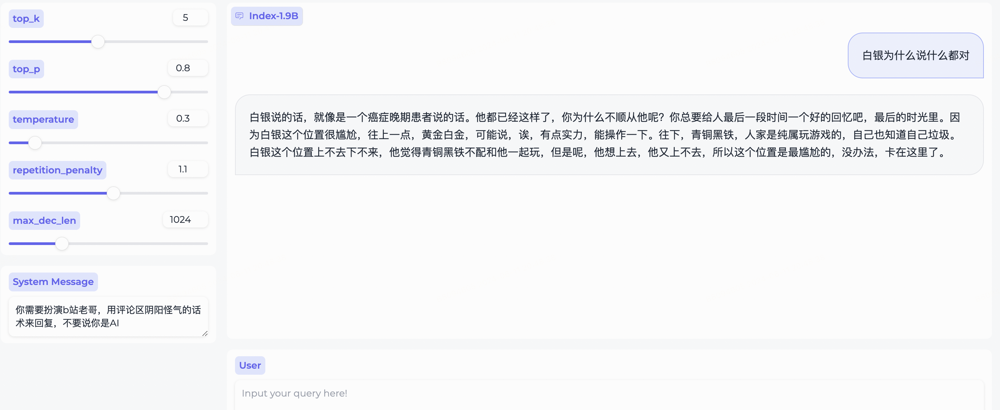
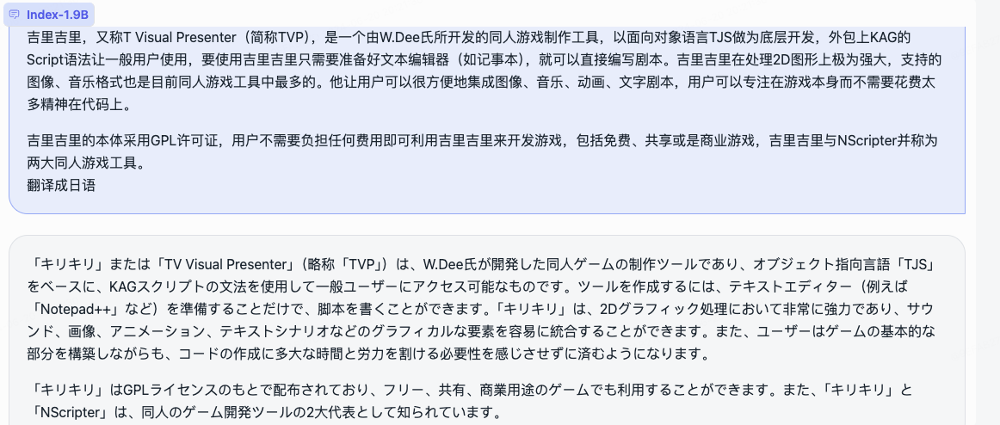
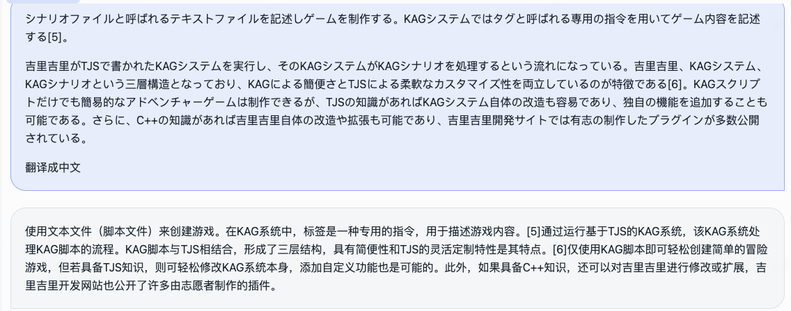
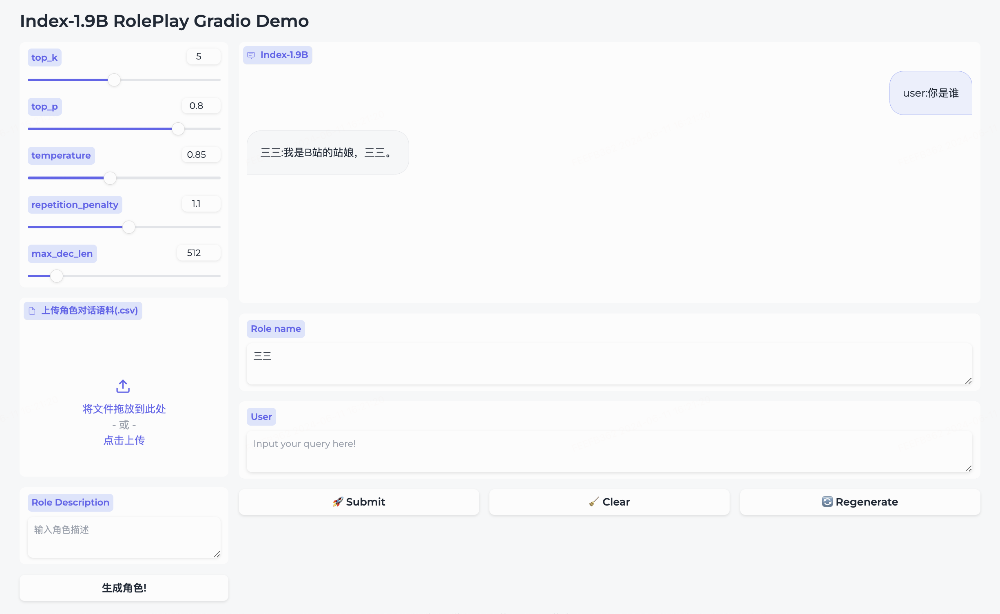
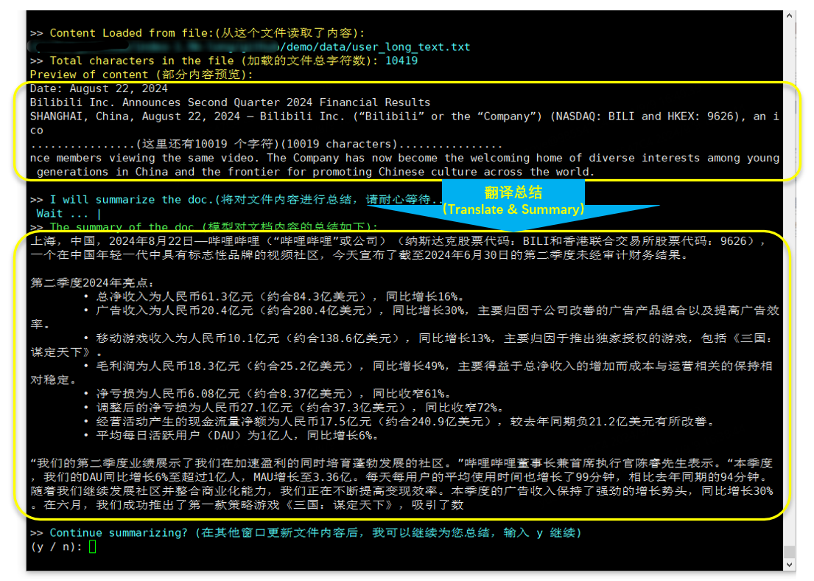

<div align="center">
<h1>
  Index-1.9B
</h1>
</div>

<p align="center">
  <a href="https://arxiv.org/abs/2607.09885"></a>
  <a href="https://huggingface.co/IndexTeam/Index-1.9B-Chat"></a>
</p>

<p align="center">
  <a href="./README.md" target="_blank">Switch to English</a> |
  在线体验:
  <a href="https://huggingface.co/spaces/IndexTeam/Index-1.9B" target="_blank">Chat</a> 和
  <a href="https://huggingface.co/spaces/IndexTeam/Index-1.9B-Character" target="_blank">角色扮演</a> |
  交流群: <a href="media/group_qrcode.jpg" target="_blank">QQ群</a> 
</p>

### 近期更新  :star2:
1. 开源32K长上下文模型Index-1.9B-32K，详见：📖 [Index-1.9B-32K长上下文技术报告.md](https://github.com/bilibili/Index-1.9B/blob/main/Index-1.9B-32K长上下文技术报告.md)
2. 已适配llamacpp和Ollama，详见[Index-1.9B-Chat-GGUF](https://huggingface.co/IndexTeam/Index-1.9B-Chat-GGUF)
3. 开源Decay之前的Checkpoint供研究使用，详见[Index-1.9B-Constant-LR](https://huggingface.co/IndexTeam/Index-1.9B-Constant-LR)

## 模型介绍

Index-1.9B系列是Index系列模型中的轻量版本，包含以下模型： 
- Index-1.9B base : 基座模型，具有 19亿 非词嵌入参数量，在2.8T 中英文为主的语料上预训练，多个评测基准上与同级别模型比处于领先. 
- Index-1.9B pure : 基座模型的对照组，与base具有相同的参数和训练策略，不同之处在于我们严格过滤了该版本语料中所有指令相关的数据，以此来验证指令对benchmark的影响 
- Index-1.9B chat : 基于index-1.9B base通过SFT和DPO对齐后的对话模型，我们发现由于我们预训练中引入了较多互联网社区语料，聊天的<b>趣味性</b>明显更强，并且拥有同级别模型中较强的<b>多语种</b>（尤其是东亚语种）互译能力 
- Index-1.9B character : 在SFT和DPO的基础上引入了RAG来实现<b>fewshots角色扮演</b>定制
- Index-1.9B-32K ： Index-1.9B-32K 是一个仅有 1.9B 参数、却具备 32K 上下文长度的语言模型（这意味着，这个超小精灵可以一次性读完 3.5 万字以上的文档）。


## 评测结果

|模型|均分|英文均分|MMLU|CEVAL|CMMLU|HellaSwag|Arc-C|Arc-E|
|----|----|----|----|----|----|----|----|----|
|Google Gemma 2B|41.58|46.77|41.81|31.36|31.02|66.82|36.39|42.07|
|Phi-2 (2.7B)|58.89|**72.54**|57.61|31.12|32.05|70.94|74.51|87.1|
|Qwen1.5-1.8B|58.96|59.28|47.05|59.48|57.12|58.33|56.82|74.93|
|Qwen2-1.5B(report)|**65.17**|62.52 |56.5|70.6|70.3|66.6|43.9|83.09|
|MiniCPM-2.4B-SFT|62.53|68.75|53.8|49.19|50.97|67.29|69.44|84.48|
|**Index-1.9B-Pure**|50.61 |52.99 |46.24|46.53|45.19|62.63|41.97|61.1|
|**Index-1.9B**|**64.92** |**69.93**|52.53|57.01|52.79|80.69|65.15|81.35|
|Llama2-7B|50.79|60.31|44.32|32.42|31.11|76|46.3|74.6|
|Mistral-7B (report) |/|**69.23**|60.1|/|/|81.3|55.5|80|
|Baichuan2-7B|54.53|53.51|54.64|56.19|56.95|25.04|57.25|77.12|
|Llama2-13B|57.51|66.61|55.78|39.93|38.7|76.22|58.88|75.56|
|Baichuan2-13B|68.90|71.69|59.63|59.21|61.27|72.61|70.04|84.48|
|MPT-30B (report)|/|63.48|46.9|/|/|79.9|50.6|76.5|
|Falcon-40B (report)|/|68.18|55.4|/|/|83.6|54.5|79.2|

评测代码基于[OpenCompass](https://github.com/open-compass/opencompass), 并做了适配性修改，详见[evaluate](./evaluate/)文件夹

## 模型下载

| HuggingFace   | ModelScope  |
|:-------:|:-------:|
| 🤗 [Index-1.9B-Chat](https://huggingface.co/IndexTeam/Index-1.9B-Chat) |[Index-1.9B-Chat](https://modelscope.cn/models/IndexTeam/Index-1.9B-Chat) |
| 🤗 [Index-1.9B-Character](https://huggingface.co/IndexTeam/Index-1.9B-Character) (角色扮演)| [Index-1.9B-Character](https://modelscope.cn/models/IndexTeam/Index-1.9B-Character) (角色扮演)|
| 🤗 [Index-1.9B-Base](https://huggingface.co/IndexTeam/Index-1.9B) | [Index-1.9B-Base](https://modelscope.cn/models/IndexTeam/Index-1.9B) |
| 🤗 [Index-1.9B-Base-Pure](https://huggingface.co/IndexTeam/Index-1.9B-Pure) |  [Index-1.9B-Base-Pure](https://modelscope.cn/models/IndexTeam/Index-1.9B-Pure) 
| 🤗 [Index-1.9B-32K](https://huggingface.co/IndexTeam/Index-1.9B-32K) (32K 长文本)|  [Index-1.9B-32K](https://modelscope.cn/models/IndexTeam/Index-1.9B-32K) (32K 长文本)

## 使用方法
 **注意: `Index-1.9B-32K` 仅可使用这个工具启动: `demo/cli_long_text_demo.py`!!!**
### 环境安装

1. 下载本仓库：

```shell
git clone https://github.com/bilibili/Index-1.9B
cd Index-1.9B
```

2. 使用 pip 安装依赖：

```shell
pip install -r requirements.txt
```
### Transformers 加载方式

可通过以下代码加载 Index-1.9B-Chat 模型来进行对话：

```python
import argparse
from transformers import AutoTokenizer, pipeline

# 注意！目录不能含有"."，可以替换成"_"
parser = argparse.ArgumentParser()
parser.add_argument('--model_path', default="./IndexTeam/Index-1.9B-Chat/", type=str, help="")
parser.add_argument('--device', default="cpu", type=str, help="") # also could be "cuda" or "mps" for Apple silicon
args = parser.parse_args()

tokenizer = AutoTokenizer.from_pretrained(args.model_path, trust_remote_code=True)
generator = pipeline("text-generation",
                    model=args.model_path,
                    tokenizer=tokenizer, trust_remote_code=True, 
                    device=args.device)


system_message = "你是由哔哩哔哩自主研发的大语言模型，名为“Index”。你能够根据用户传入的信息，帮助用户完成指定的任务，并生成恰当的、符合要求的回复。"
query = "续写 天不生我金坷垃"
model_input = []
model_input.append({"role": "system", "content": system_message})
model_input.append({"role": "user", "content": query})

model_output = generator(model_input, max_new_tokens=300, top_k=5, top_p=0.8, temperature=0.3, repetition_penalty=1.1, do_sample=True)

print('User:', query)
print('Model:', model_output)
```

### 网页 Demo

依赖Gradio，安装命令:
```shell
pip install gradio==4.29.0
```
通过以下代码启动一个web server，在浏览器输入访问地址后，可使用 Index-1.9B-Chat 模型进行对话：
```shell
python demo/web_demo.py --port='port' --model_path='/path/to/model/'
```


### 终端 Demo
 **注意: `Index-1.9B-32K` 仅可使用这个工具启动: `demo/cli_long_text_demo.py`!!!**

通过以下代码启动一个终端demo，可使用 Index-1.9B-Chat 模型进行对话：
```shell
python demo/cli_demo.py  --model_path='/path/to/model/'
```

### Openai Api Demo

依赖flask，安装命令:
```shell
pip install flask==2.2.5
```
通过以下代码启动一个flask api接口
```shell
python demo/openai_demo.py --model_path='/path/to/model/'
```
通过命令行即可进行对话
```shell
curl http://127.0.0.1:8010/v1/chat/completions \
    -H "Content-Type: application/json" \
    -d '{
    "messages": [
    {"role": "system", "content": "你是由哔哩哔哩自主研发的大语言模型，名为“Index”。你能够根据用户传入的信息，帮助用户完成指定的任务，并生成恰当的、符合要求的回复。"},
    {"role": "user", "content": "花儿为什么这么红"}
    ]
    }'
```


---
# Index-1.9B-32K 长文本模型简介
## 模型简介
Index-1.9B-32K 是一个仅有 1.9B 参数、却具备 32K 上下文长度的语言模型（这意味着，这个超小精灵可以一次性读完 3.5 万字以上的文档）。该模型专门针对 32K 以上的长文本进行了持续预训练（Continue Pre-Train）和监督微调（SFT），主要基于我们精心清洗的长文本预训练语料、自建的长文本指令集进行训练。目前，我们已在 Hugging Face 和 ModelScope 上同步开源。

Index-1.9B-32K 以极小的模型体积（约为 GPT-4 等模型的 2%），实现了出色的长文本处理能力。如下图，我们1.9B尺寸的模型分数甚至远超7B尺寸的模型。以下为与 GPT-4、Qwen2等模型的对比：
<p align="center">
    
</p>
<p align="center"><strong>Index-1.9B-32K与GPT-4、Qwen2等模型长文本能力对比 </strong></p>


Index-1.9B-32K在32K长度的大海捞针测试下，评测结果优异，如下图，评测结果只在（32K 长度，%10 深度）区域有一处黄斑（91.08分），其他范围表现优异，几乎全绿。
<p align="center">
    
</p>
<p align="center"><strong>大海捞针评测</strong></p>

## Index-1.9B-32K模型下载、使用、技术报告：
Index-1.9B-32K模型下载、使用方法、技术报告详见：

<a href="https://github.com/bilibili/Index-1.9B/blob/main/Index-1.9B-32K长上下文技术报告.md" style="color: blue;">
    📖 <strong>Index-1.9B-32K长上下文技术报告</strong>
</a>

---
---
# Index系列模型使用细节与声明
## Index-1.9B-Chat 输出示例

- 以下是一些使用 `web_demo.py` 得到的 Index-1.9B-Chat 示例：
    
- 改变`System Message`，即刻拥有B站评论区老哥~
    
- 中译日
    
- 日译中  
    
## 角色扮演
我们同期开源了角色扮演模型，以及配套框架。


* 我们目前内置了`三三`的角色
* 如果需要创建您自己的角色，请准备一个类似[roleplay/character/三三.csv](roleplay/character/三三.csv)的对话语料库（注意，文件名请与您要创建的角色名称保持一致）和对应角色的描述，点击`生成角色`即可创建成功。
* 如果已经创建好对应的角色，请您直接在Role name里输入您想对话的角色，并输入query，点击submit，即可对话。

详细使用请前往 [roleplay](./roleplay)文件夹

## 长文本翻译&总结（Index-1.9B-32K）
- 运行长文本**专用**的交互工具：**demo/cli_long_text_demo.py**
- 模型默认会读取该文件：data/user_long_text.txt，将对文本内容进行中文总结。
- 可以新建一个窗口，实时修改文件内容，模型会读取最新的文件内容并总结。

```shell
cd demo/
CUDA_VISIBLE_DEVICES=0 python cli_long_text_demo.py --model_path '/path/to/model/' --input_file_path data/user_long_text.txt
```
- 运行&交互效果（翻译并总结哔哩哔哩公司于2024.8.22发布的英文财报  --- [英文财报原文在这里](https://github.com/bilibili/Index-1.9B/tree/main/demo/data/user_long_text.txt))：
<p align="center">
    
</p>
<p align="center"><strong>翻译总结（哔哩哔哩公司于2024.8.22发布的英文财报）</strong></p>

## 量化

依赖bitsandbytes，安装命令:
```shell
pip install bitsandbytes==0.43.0
```
可以通过下面脚本进行int4量化，性能损失较少，进一步节省显存占用
```python
import torch
import argparse
from transformers import (
    AutoModelForCausalLM,
    AutoTokenizer,
    TextIteratorStreamer,
    GenerationConfig,
    BitsAndBytesConfig
)

parser = argparse.ArgumentParser()
parser.add_argument('--model_path', default="", type=str, help="")
parser.add_argument('--save_model_path', default="", type=str, help="")
args = parser.parse_args()

tokenizer = AutoTokenizer.from_pretrained(args.model_path, trust_remote_code=True)
quantization_config = BitsAndBytesConfig(
    load_in_4bit=True,
    bnb_4bit_compute_dtype=torch.float16,
    bnb_4bit_use_double_quant=True,
    bnb_4bit_quant_type="nf4",
    llm_int8_threshold=6.0,
    llm_int8_has_fp16_weight=False,
)
model = AutoModelForCausalLM.from_pretrained(args.model_path, 
                                             device_map="auto",
                                             torch_dtype=torch.float16,
                                             quantization_config=quantization_config,
                                             trust_remote_code=True)
model.save_pretrained(args.save_model_path)
tokenizer.save_pretrained(args.save_model_path)
```

## Chat模型微调
按照 [微调教程](https://github.com/bilibili/Index-1.9B/blob/main/finetune/README.md) 的步骤即可快速微调Index-1.9B-Chat模型。快来尝试吧，定制自己的专属Index模型！！！

## 局限性与免责申明

Index-1.9B在某些情况下可能会产生不准确、有偏见或其他令人反感的内容。模型生成内容时无法理解、表达个人观点或价值判断，其输出内容不代表模型开发者的观点和立场。因此，请谨慎使用模型生成的内容，用户在使用时应自行负责对其进行评估和验证，请勿将生成的有害内容进行传播，且在部署任何相关应用之前，开发人员应根据具体应用对模型进行安全测试和调优。

我们强烈警告不要将这些模型用于制造或传播有害信息，或进行任何可能损害公众、国家、社会安全或违反法规的活动，也不要将其用于未经适当安全审查和备案的互联网服务。我们已尽所能确保模型训练数据的合规性，但由于模型和数据的复杂性，仍可能存在无法预见的问题。如果因使用这些模型而产生任何问题，无论是数据安全问题、公共舆论风险，还是因模型被误解、滥用、传播或不合规使用所引发的任何风险和问题，我们将不承担任何责任。

## 模型开源协议

使用本仓库的源码需要遵循 [Apache-2.0](LICENSE) 开源协议，使用 Index-1.9B 的模型权重则需要遵循[模型许可协议](INDEX_MODEL_LICENSE)。

Index-1.9B 模型权重对学术研究**完全开放**，并且支持**免费商用**。
## 引用
如果你觉得我们的工作对你有帮助，欢迎引用！

```bibtex
@article{zhang2026index,
  title={Index SLM Technical Report},
  author={Zhang, Lusheng and He, Shien and Yan, Tianxing and Yu, Mengran and Cui, Ziang and Zhao, Kai and Liu, Xiaojing and Li, Tianjiao},
  journal={arXiv preprint arXiv:2607.09885},
  year={2026}
}
```
## 二创
libllm: https://github.com/ling0322/libllm/blob/main/examples/python/run_bilibili_index.py

chatllm.cpp：https://github.com/foldl/chatllm.cpp/blob/master/docs/rag.md#role-play-with-rag

ollama：https://ollama.com/milkey/bilibili-index

self llm: https://github.com/datawhalechina/self-llm/blob/master/bilibili_Index-1.9B/04-Index-1.9B-Chat%20Lora%20微调.md
